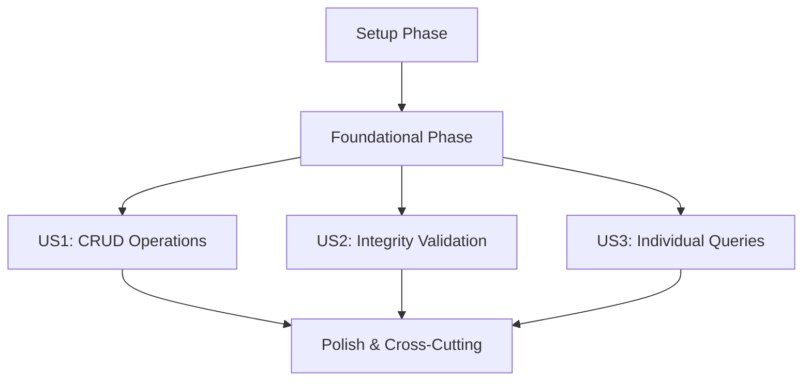

# Tasks: CRUD de Departamentos

**Input**: Design documents from `/specs/002-crud-departamentos/`
**Prerequisites**: plan.md (required), spec.md (required for user stories), research.md, data-model.md, contracts/

**Tests**: Tests are included as the implementation already exists and should be validated.

**Organization**: Tasks are grouped by user story to enable independent implementation and testing of each story.

## Format: `[ID] [P?] [Story] Description`

- **[P]**: Can run in parallel (different files, no dependencies)
- **[Story]**: Which user story this task belongs to (e.g., US1, US2, US3)
- Include exact file paths in descriptions

## Path Conventions

Paths assume Spring Boot single project structure at repository root.

## Phase 1: Setup (Shared Infrastructure)

**Purpose**: Project initialization and foundational components

- [X] T001 Verify PostgreSQL schema migration V3__create_departamentos_and_fk_empleados.sql exists
- [X] T002 Verify Docker Compose configuration includes PostgreSQL service for departamentos
- [X] T003 [P] Verify Spring Boot application.properties includes departamentos-related configurations
- [X] T004 [P] Verify GlobalExceptionHandler.java handles department-specific exceptions
- [X] T005 [P] Verify SecurityConfig.java includes authentication requirements for department endpoints

## Phase 2: Foundational (Blocking Prerequisites)

**Purpose**: Core infrastructure that all user stories depend on

- [X] T006 Verify Departamento.java entity exists in src/main/java/com/dsw/practica02/empleados/domain/
- [X] T007 Verify DepartamentoRepository.java exists in src/main/java/com/dsw/practica02/empleados/repository/
- [X] T008 [P] Verify DepartamentoMapper.java exists in src/main/java/com/dsw/practica02/empleados/dto/
- [X] T009 [P] Verify AbstractIntegrationTest.java base class supports department testing
- [X] T010 Verify foreign key relationship from Empleado to Departamento is properly configured

## Phase 3: User Story 1 - Gestionar Departamentos Empresariales (P1)

**Story Goal**: Administradores pueden realizar operaciones CRUD básicas en departamentos

**Independent Test**: Operaciones CRUD completas funcionan independientemente del módulo de empleados

**Implementation Tasks**:

### Domain Layer
- [X] T011 [P] [US1] Validate Departamento entity annotations in src/main/java/com/dsw/practica02/empleados/domain/Departamento.java
- [X] T012 [P] [US1] Validate DepartamentoCreateRequest DTO in src/main/java/com/dsw/practica02/empleados/dto/DepartamentoCreateRequest.java
- [X] T013 [P] [US1] Validate DepartamentoUpdateRequest DTO in src/main/java/com/dsw/practica02/empleados/dto/DepartamentoUpdateRequest.java
- [X] T014 [P] [US1] Validate DepartamentoResponse DTO in src/main/java/com/dsw/practica02/empleados/dto/DepartamentoResponse.java

### Repository Layer  
- [X] T015 [US1] Validate DepartamentoRepository CRUD methods in src/main/java/com/dsw/practica02/empleados/repository/DepartamentoRepository.java
- [ ] T016 [US1] Test repository findAll with Pageable support for listing departments
- [ ] T017 [US1] Test repository existsByNombre for uniqueness validation

### Service Layer
- [X] T018 [US1] Validate DepartamentoService.java business logic in src/main/java/com/dsw/practica02/empleados/service/DepartamentoService.java
- [X] T019 [US1] Test createDepartamento method with DTO mapping and validation
- [X] T020 [US1] Test updateDepartamento method with uniqueness validation
- [X] T021 [US1] Test listDepartamentos method with pagination parameters
- [X] T022 [US1] Test getDepartamentoById method with UUID validation

### Controller Layer
- [X] T023 [US1] Validate DepartamentoController REST endpoints in src/main/java/com/dsw/practica02/empleados/controller/DepartamentoController.java
- [X] T024 [US1] Test POST /api/v1/departamentos endpoint with @Valid request body
- [X] T025 [US1] Test GET /api/v1/departamentos endpoint with Pageable parameters
- [X] T026 [US1] Test GET /api/v1/departamentos/{id} endpoint with UUID path variable
- [X] T027 [US1] Test PUT /api/v1/departamentos/{id} endpoint with validation

### Integration Tests
- [ ] T028 [US1] Test complete CREATE flow in DepartamentoControllerTest.java
- [ ] T029 [US1] Test complete READ flows (list and get by id) in DepartamentoControllerTest.java
- [ ] T030 [US1] Test complete UPDATE flow in DepartamentoControllerTest.java

## Phase 4: User Story 2 - Validar Integridad de Departamentos (P2)

**Story Goal**: Sistema garantiza integridad de datos y previene eliminaciones conflictivas

**Independent Test**: Validaciones funcionan correctamente para nombres duplicados y eliminación protegida

**Implementation Tasks**:

### Constraint Validation
- [ ] T031 [P] [US2] Validate unique constraint on nombre field in Departamento entity
- [ ] T032 [P] [US2] Test @NotNull validation on nombre field in DTOs
- [ ] T033 [P] [US2] Test @Size(max=100) validation on nombre field in DTOs

### Business Logic Validation  
- [ ] T034 [US2] Test duplicate name validation in DepartamentoService.createDepartamento
- [ ] T035 [US2] Test duplicate name validation in DepartamentoService.updateDepartamento
- [ ] T036 [US2] Implement employee reference check in DepartamentoService.deleteDepartamento
- [ ] T037 [US2] Test referential integrity validation before department deletion

### Error Handling
- [ ] T038 [P] [US2] Test 409 Conflict response for duplicate department names
- [ ] T039 [P] [US2] Test 409 Conflict response for department deletion with employees
- [ ] T040 [P] [US2] Test 400 Bad Request response for validation failures

### Controller Integration
- [ ] T041 [US2] Test DELETE /api/v1/departamentos/{id} endpoint validation in DepartamentoController
- [ ] T042 [US2] Integration test for conflict scenarios in DepartamentoControllerTest.java
- [ ] T043 [US2] Integration test for validation error scenarios in DepartamentoControllerTest.java

## Phase 5: User Story 3 - Consultar Departamento Específico (P3)

**Story Goal**: Administradores pueden consultar detalles de departamentos individuales

**Independent Test**: Consulta por ID funciona con validación de UUID y manejo de errores 404

**Implementation Tasks**:

### UUID Validation
- [ ] T044 [P] [US3] Implement UUID format validation in controller method parameters  
- [ ] T045 [P] [US3] Test 400 Bad Request response for malformed UUID in path variable

### Service Layer Enhancement
- [ ] T046 [US3] Enhance getDepartamentoById service method with Optional handling
- [ ] T047 [US3] Test service method throws appropriate exception for non-existent department

### Controller Enhancement  
- [ ] T048 [US3] Test GET /api/v1/departamentos/{id} returns 404 for non-existent department
- [ ] T049 [US3] Test GET /api/v1/departamentos/{id} returns complete department details with timestamps

### Integration Tests
- [ ] T050 [US3] Integration test for successful department retrieval by ID
- [ ] T051 [US3] Integration test for 404 response with non-existent department ID
- [ ] T052 [US3] Integration test for 400 response with malformed UUID

## Phase 6: Polish & Cross-Cutting Concerns

**Purpose**: Final validation, documentation, and production readiness

### API Documentation
- [ ] T053 [P] Verify Swagger/OpenAPI annotations on DepartamentoController endpoints
- [ ] T054 [P] Validate API documentation matches contracts/departments-api.md specification
- [ ] T055 [P] Test Swagger UI renders correctly for department endpoints

### Security & Authorization  
- [ ] T056 [P] Test HTTP Basic authentication requirement for all department endpoints
- [ ] T057 [P] Test administrator role requirement for all department operations
- [ ] T058 [P] Verify unauthorized access returns 401/403 responses appropriately

### Performance & Monitoring
- [ ] T059 [P] Test pagination performance with large dataset (1000+ departments)
- [ ] T060 [P] Verify database indexes exist for nombre and departamento_id fields
- [ ] T061 [P] Test concurrent operations performance (100 simultaneous requests)

### Production Readiness
- [ ] T062 [P] Verify application.properties profiles (dev/test/prod) include department configurations
- [ ] T063 [P] Test Docker Compose setup with PostgreSQL persistence
- [ ] T064 [P] Verify Flyway migrations run successfully in clean environment

## Dependencies

### User Story Completion Order

### Critical Path
1. **Setup + Foundational** (T001-T010): Must complete first - provides infrastructure
2. **US1 (P1)** (T011-T030): MVP functionality - enables basic department management  
3. **US2 (P2)** (T031-T043): Data integrity - prevents data corruption
4. **US3 (P3)** (T044-T052): Enhanced queries - improves user experience
5. **Polish** (T053-T064): Production readiness

### Parallel Execution Opportunities

**Phase 3 (US1) Parallelization:**
- Domain Layer (T011-T014): Independent DTO/Entity validation
- Repository Tests (T016-T017): Independent from service layer
- Service Tests (T019-T022): Can run parallel with controller development
- Controller Tests (T024-T027): Can develop parallel with service layer

**Phase 4 (US2) Parallelization:**  
- Constraint Validation (T031-T033): Independent validation testing
- Error handling (T038-T040): Independent response testing

**Phase 6 (Polish) Parallelization:**
- All tasks T053-T064 can run in parallel as they test different aspects

## Implementation Strategy

### MVP Delivery (Minimum Viable Product)
**Scope**: Complete User Story 1 (P1) only
- **Tasks**: T001-T030 
- **Timeline**: Enables basic department CRUD operations
- **Value**: Administrators can manage department structure
- **Independent Test**: Full CRUD operations work without employee integration

### Incremental Delivery Plan

1. **Sprint 1**: Setup + Foundational + US1 MVP (T001-T030)
   - Deliverable: Basic department CRUD working
   - Value: Core functionality operational

2. **Sprint 2**: US2 - Data Integrity (T031-T043) 
   - Deliverable: Validation and referential integrity
   - Value: Data consistency guaranteed

3. **Sprint 3**: US3 - Enhanced Queries (T044-T052)
   - Deliverable: Individual department queries with validation
   - Value: Complete query functionality

4. **Sprint 4**: Polish & Production (T053-T064)
   - Deliverable: Production-ready system
   - Value: Scalable, documented, secure system

### Quality Gates

**After Each Phase:**
- All tests passing
- Code coverage > 80% for new/modified code  
- API documentation updated
- Integration tests passing with real PostgreSQL

**Before Production:**
- All constitutional requirements validated
- Performance benchmarks met (<200ms p95)
- Security audit passed
- Docker deployment verified