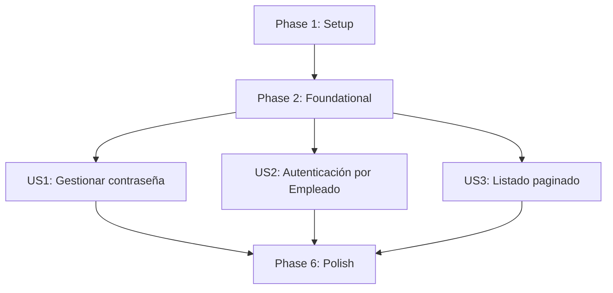

# Tasks: Ajustes Password Empleado

**Input**: Design documents from `/specs/003-password/`  
**Prerequisites**: plan.md (required), spec.md (required for user stories), research.md, data-model.md, contracts/

**Tests**: Se incluyen tareas de pruebas automáticas (unitarias y de integración) por historia de usuario, en cumplimiento de la constitución del proyecto.  
**Organization**: Tasks grouped by user story to allow independent implementation and validation.

## Format: `[ID] [P?] [Story] Description`

- **[P]**: Can run in parallel (different files, no dependency on incomplete tasks)
- **[Story]**: User story label (`[US1]`, `[US2]`, `[US3]`) only for story phases
- Every task includes an exact file path

## Phase 1: Setup (Shared Infrastructure)

**Purpose**: Preparar configuración compartida para seguridad y paginación.

- [X] T001 Crear configuración tipada de límites y defaults en `src/main/java/com/dsw/practica02/empleados/config/EmpleadoFeatureProperties.java`
- [X] T002 [P] Registrar propiedades de feature en `src/main/resources/application.properties`
- [X] T003 [P] Registrar propiedades de feature para perfil test en `src/main/resources/application-test.properties`

---

## Phase 2: Foundational (Blocking Prerequisites)

**Purpose**: Infraestructura base obligatoria antes de cualquier historia.

**⚠️ CRITICAL**: Ninguna historia debe iniciar antes de completar esta fase.

- [X] T004 Integrar `EmpleadoFeatureProperties` en `src/main/java/com/dsw/practica02/empleados/service/EmpleadoService.java`
- [X] T005 Consolidar utilitarios compartidos de normalización/validación en `src/main/java/com/dsw/practica02/empleados/service/EmpleadoService.java`
- [X] T006 Ajustar contrato de error reutilizable en `src/main/java/com/dsw/practica02/empleados/config/ApiError.java`
- [X] T007 Actualizar mapeo global de excepciones base en `src/main/java/com/dsw/practica02/empleados/config/GlobalExceptionHandler.java`

**Checkpoint**: Base técnica lista para implementar historias de usuario.

---

## Phase 3: User Story 1 - Gestionar contraseña de empleado (Priority: P1) 🎯 MVP

**Goal**: Altas y actualizaciones de empleado exigen contraseña y nunca la exponen en respuesta.

**Independent Test Criteria**: Crear y actualizar empleados con `password` válida; validar rechazo de contraseñas inválidas y ausencia de `password` en responses.

### Automated Tests for User Story 1

- [X] T008 [US1] Crear pruebas de codificación y no almacenamiento plano de password en `src/test/java/com/dsw/practica02/empleados/service/EmpleadoServiceTest.java`
- [X] T009 [US1] Crear prueba de respuestas sin campo `password` en `src/test/java/com/dsw/practica02/empleados/controller/EmpleadoControllerIntegrationTest.java`

### Implementation for User Story 1

- [X] T010 [P] [US1] Asegurar persistencia obligatoria del campo `password` en `src/main/java/com/dsw/practica02/empleados/domain/Empleado.java`
- [X] T011 [P] [US1] Exigir validación de `password` en alta en `src/main/java/com/dsw/practica02/empleados/dto/EmpleadoCreateRequest.java`
- [X] T012 [P] [US1] Exigir validación de `password` en actualización en `src/main/java/com/dsw/practica02/empleados/dto/EmpleadoUpdateRequest.java`
- [X] T013 [US1] Codificar `password` en flujo de alta en `src/main/java/com/dsw/practica02/empleados/service/EmpleadoService.java`
- [X] T014 [US1] Codificar `password` en flujo de actualización en `src/main/java/com/dsw/practica02/empleados/service/EmpleadoService.java`
- [X] T015 [US1] Mantener exclusión de `password` del DTO de salida en `src/main/java/com/dsw/practica02/empleados/dto/EmpleadoResponse.java`
- [X] T016 [US1] Alinear mapeo de salida sin `password` en `src/main/java/com/dsw/practica02/empleados/dto/EmpleadoMapper.java`
- [X] T017 [US1] Documentar reglas de contraseña en contrato API en `specs/003-password/contracts/employees-api.md`

**Checkpoint**: US1 implementable y validable sin depender de US2/US3.

---

## Phase 4: User Story 2 - Autenticación por entidad Empleado (Priority: P1)

**Goal**: Autenticación HTTP Basic basada en `Empleado` con política de bootstrap controlada.

**Independent Test Criteria**: Endpoint protegido acepta credenciales válidas de empleado, rechaza inválidas y solo permite `POST /api/v1/empleados` público cuando no existen empleados.

### Automated Tests for User Story 2

- [X] T018 [US2] Crear prueba de autenticación válida e inválida en `src/test/java/com/dsw/practica02/empleados/controller/EmpleadoControllerIntegrationTest.java`
- [X] T019 [US2] Crear prueba de bootstrap público solo con `count=0` en `src/test/java/com/dsw/practica02/empleados/controller/EmpleadoControllerIntegrationTest.java`

### Implementation for User Story 2

- [X] T020 [US2] Configurar `PasswordEncoder` delegante en `src/main/java/com/dsw/practica02/empleados/config/SecurityConfig.java`
- [X] T021 [US2] Implementar `UserDetailsService` con lookup por `clave` en `src/main/java/com/dsw/practica02/empleados/config/SecurityConfig.java`
- [X] T022 [US2] Crear autorización condicional de bootstrap en `src/main/java/com/dsw/practica02/empleados/config/BootstrapEmpleadoAuthorizationManager.java`
- [X] T023 [US2] Integrar regla de bootstrap y restricciones de endpoints en `src/main/java/com/dsw/practica02/empleados/config/SecurityConfig.java`
- [X] T024 [US2] Garantizar rol efectivo `ADMIN` para empleados autenticados en `src/main/java/com/dsw/practica02/empleados/config/SecurityConfig.java`
- [X] T025 [US2] Ajustar manejo de errores de autenticación/autorización en `src/main/java/com/dsw/practica02/empleados/config/GlobalExceptionHandler.java`
- [X] T026 [US2] Documentar autenticación y bootstrap en `specs/003-password/contracts/employees-api.md`
- [X] T027 [US2] Documentar flujo operativo de autenticación en `specs/003-password/quickstart.md`

**Checkpoint**: US2 implementable y validable independientemente con credenciales de empleado.

---

## Phase 5: User Story 3 - Listar empleados con paginación (Priority: P2)

**Goal**: Listado paginado con defaults, clamping en `size` y `400` en parámetros inválidos.

**Independent Test Criteria**: `GET /api/v1/empleados` responde página con metadatos, aplica `size<=100` y retorna `400` con `page < 0` o `size <= 0`.

### Automated Tests for User Story 3

- [X] T028 [US3] Crear prueba de metadatos paginados y clamping a 100 en `src/test/java/com/dsw/practica02/empleados/service/EmpleadoServiceTest.java`
- [X] T029 [US3] Crear prueba de `400 Bad Request` para `page < 0` o `size <= 0` en `src/test/java/com/dsw/practica02/empleados/controller/EmpleadoControllerIntegrationTest.java`

### Implementation for User Story 3

- [X] T030 [US3] Configurar defaults de paginación en `src/main/java/com/dsw/practica02/empleados/controller/EmpleadoController.java`
- [X] T031 [US3] Implementar clamping de `size` a máximo 100 en `src/main/java/com/dsw/practica02/empleados/service/EmpleadoService.java`
- [X] T032 [US3] Implementar validación de `page` y `size` inválidos en `src/main/java/com/dsw/practica02/empleados/service/EmpleadoService.java`
- [X] T033 [US3] Asegurar retorno de metadatos paginados (`content`, `totalElements`, `totalPages`, `size`, `number`) en `src/main/java/com/dsw/practica02/empleados/controller/EmpleadoController.java`
- [X] T034 [US3] Mapear invalidaciones de paginación a `400 Bad Request` en `src/main/java/com/dsw/practica02/empleados/config/GlobalExceptionHandler.java`
- [X] T035 [US3] Documentar comportamiento paginado final en `specs/003-password/contracts/employees-api.md`
- [X] T036 [US3] Documentar escenarios de paginación en `specs/003-password/quickstart.md`

**Checkpoint**: US3 implementable y validable de forma aislada con dataset de empleados.

---

## Phase 6: Polish & Cross-Cutting Concerns

**Purpose**: Cierre documental, trazabilidad y gates de calidad.

- [X] T037 [P] Consolidar decisiones técnicas finales en `specs/003-password/research.md`
- [X] T038 [P] Sincronizar plan final con alcance implementado en `specs/003-password/plan.md`
- [X] T039 [P] Verificar checklist de calidad sin pendientes en `specs/003-password/checklists/requirements.md`
- [X] T040 Ejecutar suite de pruebas automáticas y registrar evidencia en `specs/003-password/verification.md`
- [X] T041 Ejecutar validación de arranque con Docker Compose y registrar evidencia en `specs/003-password/verification.md`
- [ ] T042 Ejecutar smoke de quickstart end-to-end y registrar evidencia en `specs/003-password/verification.md` (bloqueado por resolución de dependencias Maven en entorno)

---

## Dependencies & Execution Order

### Phase Dependencies

- **Phase 1 (Setup)**: sin dependencias
- **Phase 2 (Foundational)**: depende de Phase 1; bloquea todas las historias
- **Phase 3+ (User Stories)**: dependen de Phase 2
- **Phase 6 (Polish)**: depende de historias completadas

### User Story Dependencies

- **US1 (P1)**: inicia tras Foundational; define base de manejo de contraseña
- **US2 (P1)**: inicia tras Foundational; recomendable tras US1 para reutilizar reglas de password
- **US3 (P2)**: inicia tras Foundational; depende funcionalmente de CRUD ya estable



### Within Each User Story

- Completar pruebas automáticas de la historia antes de cerrar implementación
- Completar modelo/DTO antes de service
- Completar service antes de reglas de controller/security
- Completar implementación antes de documentación final de la historia

---

## Parallel Execution Examples

### User Story 1

```bash
# Paralelizables de US1 (archivos distintos)
T010 domain/Empleado.java
T011 dto/EmpleadoCreateRequest.java
T012 dto/EmpleadoUpdateRequest.java
```

### User Story 2

```bash
# Paralelizables de US2 (archivos distintos)
T022 config/BootstrapEmpleadoAuthorizationManager.java
T027 specs/003-password/quickstart.md
```

### User Story 3

```bash
# Paralelizables de US3 (archivos distintos)
T034 config/GlobalExceptionHandler.java
T036 specs/003-password/quickstart.md
```

---

## Success Criteria Coverage

| SC | Task IDs |
|----|----------|
| SC-001 | T011, T012, T013, T014, T008 |
| SC-002 | T018 |
| SC-003 | T015, T016, T009 |
| SC-004 | T030, T033, T035, T028 |
| SC-005 | T031, T028 |
| SC-006 | T032, T034, T029 |
| SC-007 | T013, T014, T008 |

---

## Implementation Strategy

### MVP First (US1)

1. Completar Phase 1 y Phase 2
2. Implementar US1 completa (T008-T017)
3. Validar criterios independientes de US1
4. Publicar MVP

### Incremental Delivery

1. Base compartida (Phase 1 + Phase 2)
2. US1 (password en CRUD)
3. US2 (autenticación por empleado + bootstrap)
4. US3 (paginación robusta)
5. Polish transversal y gates constitucionales

### Parallel Team Strategy

1. Equipo completo en Setup + Foundational
2. Luego dividir por historia:
   - Dev A: US1
   - Dev B: US2
   - Dev C: US3
3. Cierre conjunto en Phase 6

---

## Notes

- Todas las tareas mantienen formato checklist estricto: `- [ ] T### [P?] [US?] Descripción con ruta`
- Labels `[US#]` aparecen solo en fases de historias
- Los IDs son secuenciales en orden de ejecución recomendado
- El alcance se limita a UX/API especificados en `spec.md` (sin extras)
